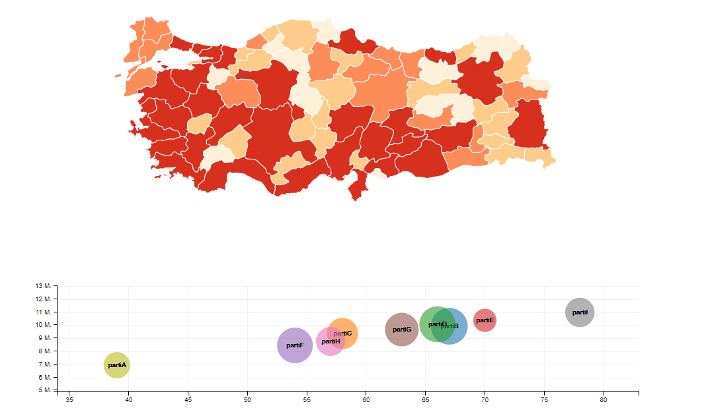

# Türkiye GeoJSON haritası
Şehirlere ayrılmış GeoJSON formatlı dosyayı Türkiye'deki şehirleri listeleme. İki adet karakter kodlamasından vardır.

İndirme linkleri: **[ANSI](geo/tr-cities-ansi.json)** / **[UTF8](geo/tr-cities-utf8.json)**

